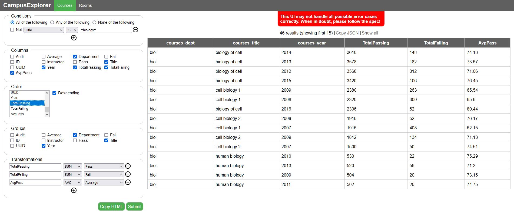

# UBC CampusExplorer

This application forms the Capstone project of the [UBCx Software Development MicroMasters Course](https://www.edx.org/micromasters/ubcx-software-development). It is a full-stack web application allowing users to query and receive information from the UBC course catalogue and rooms catalogue. This querying can be done directly with the backend REST API (plaintext EBNF query or `InsightASTQuery` object) or via the frontend UI input form.



The application was built in 4 sprints, and the requirements and result of each sprint can be seen on the corresponding repository branches:

-   [Sprint 0 / Deliverable 0: Black Box Testing](https://github.com/PLCoster/ubc_softdev_capstone/tree/d0)
-   [Sprint 1 / Deliverable 1: Basic Queries](https://github.com/PLCoster/ubc_softdev_capstone/tree/d1)
-   [Sprint 2 / Deliverable 2: Advanced Queries](https://github.com/PLCoster/ubc_softdev_capstone/tree/d2)
-   [Sprint 3 / Deliverable 3: REST Frontend](https://github.com/PLCoster/ubc_softdev_capstone/tree/d3)

The complete project was built using the following technologies:

### Front-End:

-   Vanilla **Javascript** DOM manipulation for reading and submitting queries to the API and for displaying queries.
-   **[Karma](https://karma-runner.github.io/6.4/index.html)** along with **[Mocha](https://mochajs.org/)** and **[Chai](https://www.chaijs.com/)** for front-end testing.

### Back-End:

-   **[TypeScript](https://www.typescriptlang.org/)** with **[yarn](https://yarnpkg.com/)** for package management.
-   **[restify](http://restify.com/)** Node.js web framework for the RESTful API.
-   **[JSZip](https://www.npmjs.com/package/jszip)** to extract zipped courses / rooms datasets.
-   **[parse5](https://www.npmjs.com/package/parse5)** to parse XML rooms datasets.
-   **[Mocha](https://mochajs.org/)** test framework with **[Chai](https://www.chaijs.com/)** assertions.

## Query Syntax

### Plaintext Query Syntax (UI / REST)

Plaintext queries follow the expanded EBNF query syntax shown in the Sprint 2 README. Here are some examples:

1. A basic courses dataset query for all data rows, showing all columns:

```
In courses dataset courses, find all entries; show Audit, Average, Department, Fail, ID, Instructor, Pass, Title, UUID and Year.
```

2. A courses dataset query with FILTER and ORDER clauses:

```
In courses dataset courses, find entries whose Average is greater than 97; show Department and Average; sort in ascending order by Average.
```

3. A complex courses dataset query with GROUP, FILTER, ORDER, AGGREGATION clauses:

```
In courses dataset courses grouped by Department and Title, find entries whose Title includes "biol"; show Department, Title, avgGrade, minGrade and maxGrade, where avgGrade is the AVG of Average, minGrade is the MIN of Average and maxGrade is the MAX of Average; sort in descending order by avgGrade, minGrade and maxGrade.
```

4. A complex rooms dataset query, to find the Full Name, Address, minimum and maximum number of seats in rooms of each type, for rooms with at least 50 seats in buildings with an address containing "Mall" :

```
In rooms dataset rooms grouped by Full Name, Address and Type, find entries whose Seats is greater than 50 and Address includes "Mall"; show Full Name, Address, minSeats, maxSeats and Type, where minSeats is the MIN of Seats and maxSeats is the MAX of Seats; sort in ascending order by minSeats.
```

### AST Query Syntax (REST API / Frontend UI)

As an alternative to the plaintext queries, Queries can be specified using a query AST format. Such queries can be built using the Frontend UI, or alternatively written directly and sent as the JSON body of a `POST` request to the `/query` route of the server. Shown below are the equivalent AST queries for the plaintext queries shown above:

1. A basic courses dataset query for all data rows, showing all columns:

```
    {
        "ID": "courses",
        "KIND": "courses",
        "WHERE": {},
        "OPTIONS": {
            "COLUMNS": [
                "coursesSingleEntry_audit",
                "coursesSingleEntry_avg",
                "coursesSingleEntry_dept",
                "coursesSingleEntry_fail",
                "coursesSingleEntry_id",
                "coursesSingleEntry_instructor",
                "coursesSingleEntry_pass",
                "coursesSingleEntry_title",
                "coursesSingleEntry_uuid",
                "coursesSingleEntry_year"
            ]
        }
    }
```

2. A courses dataset query with FILTER and ORDER clauses:

```
    {
        "ID": "courses",
        "KIND": "courses",
        "WHERE": { "GT": { "courses_avg": 97 } },
        "OPTIONS": {
            "COLUMNS": ["courses_dept", "courses_avg"],
            "ORDER": { "dir": "UP", "keys": ["courses_avg"] }
        }
    }
```

3. A complex courses dataset query with GROUP, FILTER, ORDER, AGGREGATION clauses:

```
    {
        "ID": "courses",
        "KIND": "courses",
        "WHERE": { "INC": { "courses_title": "biol" } },
        "OPTIONS": {
            "COLUMNS": [
                "courses_dept",
                "courses_title",
                "avgGrade",
                "minGrade",
                "maxGrade"
            ],
            "ORDER": {
                "dir": "DOWN",
                "keys": ["avgGrade", "minGrade", "maxGrade"]
            }
        },
        "TRANSFORMATIONS": {
            "GROUP": ["courses_dept", "courses_title"],
            "APPLY": [
                { "avgGrade": { "AVG": "courses_avg" } },
                { "minGrade": { "MIN": "courses_avg" } },
                { "maxGrade": { "MAX": "courses_avg" } }
            ]
        }
    }
```

4. A complex rooms dataset query, to find the Full Name, Address, minimum and maximum number of seats in rooms of each type, for rooms with at least 50 seats in buildings with an address containing "Mall" :

```
{
        "ID": "rooms",
        "KIND": "rooms",
        "WHERE": {
            "AND": [
                { "GT": { "rooms_seats": 50 } },
                { "INC": { "rooms_address": "Mall" } }
            ]
        },
        "OPTIONS": {
            "COLUMNS": [
                "rooms_fullname",
                "rooms_address",
                "minSeats",
                "maxSeats",
                "rooms_type"
            ],
            "ORDER": { "dir": "UP", "keys": ["minSeats"] }
        },
        "TRANSFORMATIONS": {
            "GROUP": ["rooms_fullname", "rooms_address", "rooms_type"],
            "APPLY": [
                { "minSeats": { "MIN": "rooms_seats" } },
                { "maxSeats": { "MAX": "rooms_seats" } }
            ]
        }
    }
```

More examples of both equivalent plaintext and AST queries can be found in `test/queries`

## Local Setup / Usage

### Configuring your environment

To start using this repository, you need to get your computer configured so you can build and execute the code. To do this, follow these steps; the specifics of each step (especially the first two) will vary based on which operating system your computer has:

1. Install git (you should be able to execute `git --version` on the command line).

1. Install Node (version 14.16.X), which will also install NPM (you should be able to execute `node --version` and `npm --version` on the command line).

1. [Install Yarn](https://yarnpkg.com/en/docs/install). You should be able to execute `yarn --version` afterwards.

### Project commands

Once your environment is configured you need to further prepare the project's tooling and dependencies. In the project folder:

1. `yarn clean` (or `yarn cleanwin` if you are using Windows) to delete your project's _node_modules_ directory.

1. `yarn install` to download the packages specified in your project's _package.json_ to the _node_modules_ directory.

1. `yarn build` to compile your project. You must run this command after making changes to your TypeScript files.

1. `yarn test` to run the backend test suite.

1. `yarn test:frontend` to run the frontend test suite.

1. `yarn start` to start the backend server locally. The app can then be viewed in the browser at [http://localhost:8080](http://localhost:8080)
